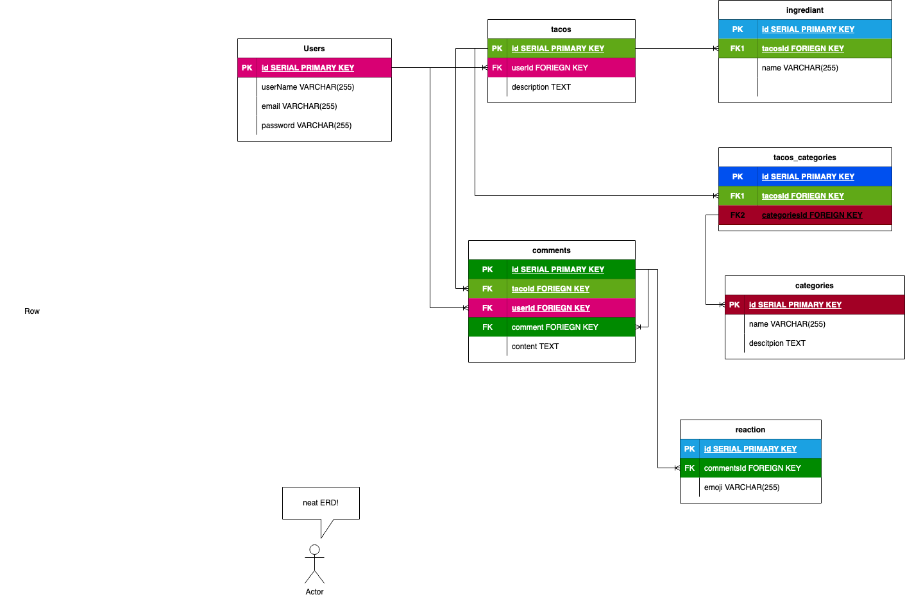
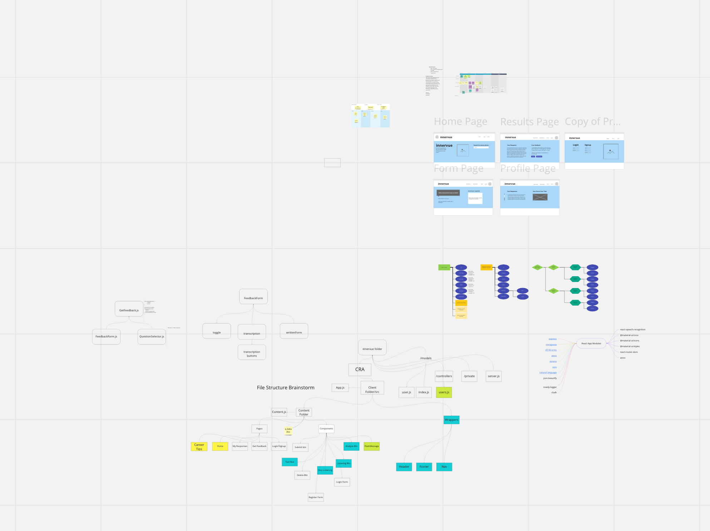
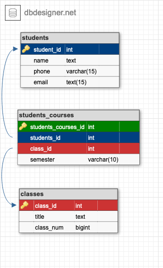
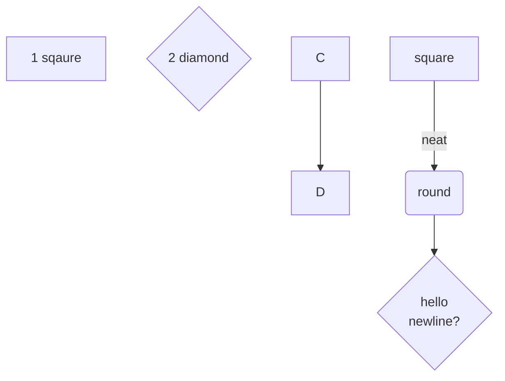
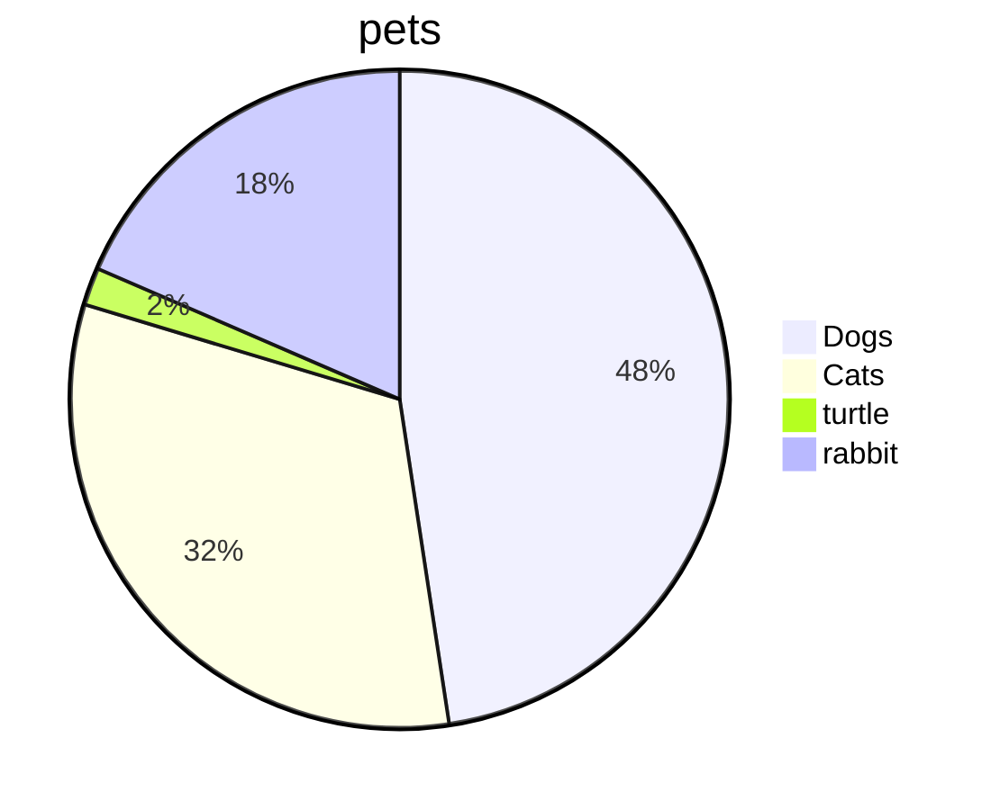
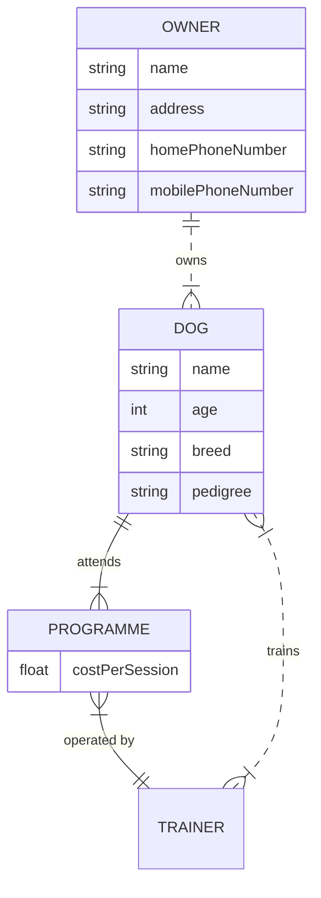

# ERDs and Charts 📈📉

## Learning objects

* describe what an ERD is 
* describe the usefulness of an ERD
* understand the basic symbols and information in an ERD
* get acquainted with several availible ERD creation tools
* (optional) get experiance using one of the ERD tools 
 
## Discussion

https://www.visual-paradigm.com/guide/data-modeling/what-is-entity-relationship-diagram/

## What is an ERD

ERD is an acronym for *ENTITY RELATIONSHIP DIAGRAM*. Entity Relationship Diagram, also known as ERD, ER Diagram or ER model, is a type of structural diagram for use in database design. An ERD contains different symbols and connectors that visualize two important information: The major entities within the system scope, and the inter-relationships among these entities.

## ERD Tools

### [Draw.io](https://app.diagrams.net) 

#### Pros:

* can embed pngs into github repo that update when ERD is updated
* can share ERDs
* can do WAY more that ERDs -- including wireframs, charts, slideshows etc
* can include mix ERDs with other types of visual aids such as text, flowcharts, icons etc
* cannot export SQL commands
* does not use SQL to make ERDs, uses its own scripting langauge which is optional

#### Cons:

* sometimes the UI can be clunky

### [Miro Boads](https://miro.com/) 

#### Pros:

* UI is intuitive and responsive
* realtime collaboration with other team members
* one stop shop for everything a team needs such as  kanban boards, brainstorming, SCRUM management
* easily makes nice looking wireframes

#### Cons:

* there is no proper what to make standard SQL ERDs, so tour ERDs look more like a flowchart
* cannot export SDL commands
* cannot export to github repos
* only two boards per unpaid account

### [db.desienger.net](https://app.dbdesigner.net)

#### Pros:

* GUI is intuitive
* allows for SQL dialect specific features
* exports raw SQL commands based on schema
* RAW sql can optinally be used to create schema
* supports templates
* allows comments on schema
* allows sharing ERDs

#### Cons:

* only allows two ERDs on an unapid account
* cannot save to/imbed in a gh repo

### [Mermaid Diagrams](https://github.com/mermaid-js/mermaid#readme) 

flowchart:

pie chart:

ERD:

#### Pros:

* built in support on github flavoered markhown
* makes nice charts

#### Cons:

* requires learning the syntax, which can be obtuse
* does support any kind of import/export

### [db diagram.net](https://dbdiagram.io/home/)

#### Pros:

* sharable ERDs
* can embed in a github repo

#### Cons:

* requires learning ERD scritping langauge

## extra resuources

* [this blog](https://desk.draw.io/support/solutions/articles/16000042371-embed-a-diagram-in-github-markdown) demonstrates how to connect your `draw.io` to your github markdowns 
* [this](https://miro.com/templates/entity-relationship-diagram/) a an ERD template to use with a mire board
* here is a [github blog](https://github.blog/2022-02-14-include-diagrams-markdown-files-mermaid/) about using mermaid in your `README.mds`
