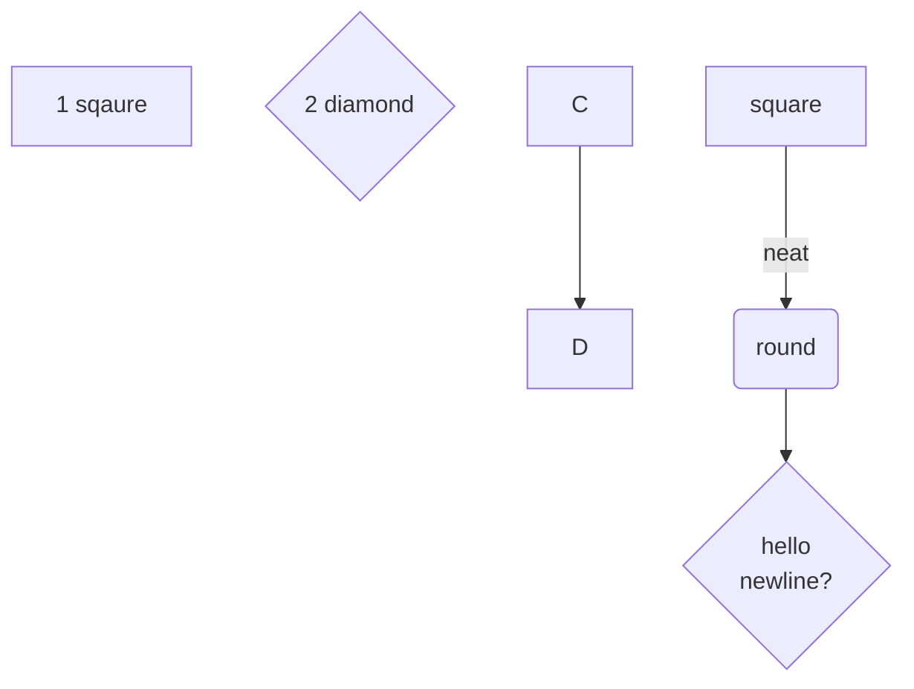
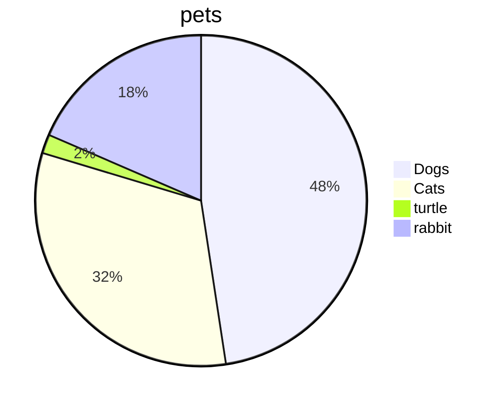

# 📈
markdown charts

```mermaid
flowchart TD;
  A[1 sqaure];
  B{2 diamond};
  C --> D;
  E[square] -- neat --> F{triangle};
  F(round) --> G{hello \n newline?};
```

```mermaid
pie title pets
    "Dogs" : 386
    "Cats" : 260
    "turtle" : 15
    "rabbit" : 150
```

[gh blog](https://github.blog/2022-02-14-include-diagrams-markdown-files-mermaid/)

[mermaid info](https://github.com/mermaid-js/mermaid#readme)
