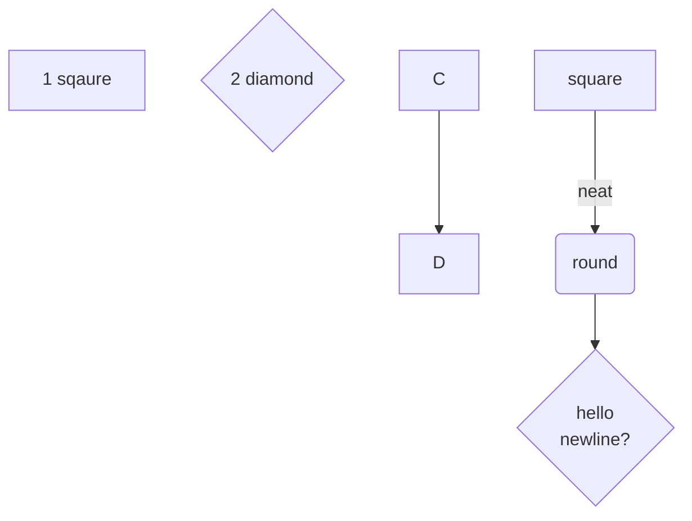
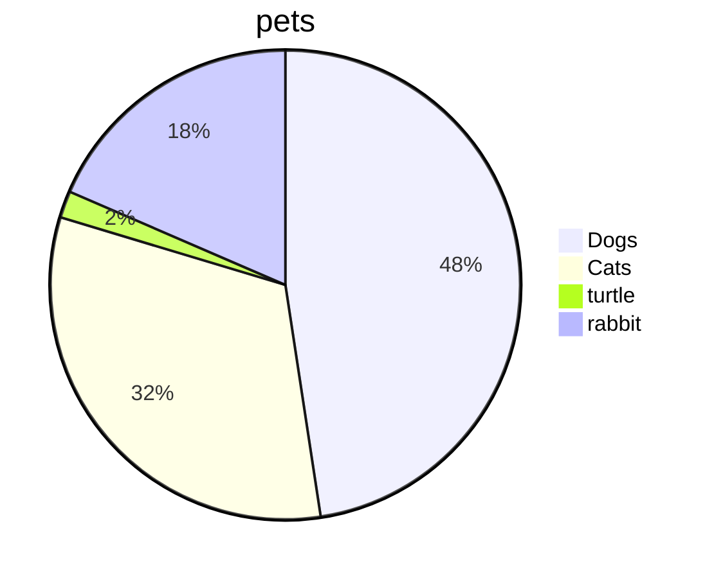
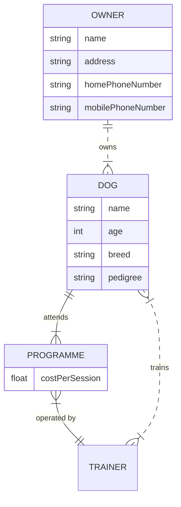

# ERDs and Charts 📈📉

Erd tools:

### [Draw.io](https://app.diagrams.net) 

#### Pros:

* can embed pngs into github repo that update when ERD is updated
* can share ERDs
* can do WAY more that ERDs -- including wireframs, charts, slideshows etc
* can include mix ERDs with other types of visual aids such as text, flowcharts, icons etc
* cannot export SQL commands
* does not use SQL to make ERDs, uses its own scripting langauge which is optional

#### Cons:

* sometimes the UI can be clunky

### [Miro Boads](https://miro.com/) 

#### Pros:

* UI is intuitive and responsive
* realtime collaboration with other team members
* one stop shop for everything a team needs such as  kanban boards, brainstorming, SCRUM management
* easily makes nice looking wireframes

#### Cons:

* there is no proper what to make ERDs, so they can come out kind of janky looking
* cannot export SDL commands
* cannot export to github repos
* only two boards per unpaid account

### [db.desienger.net](https://app.dbdesigner.net)

#### Pros:

* GUI is intuitive
* allows for SQL dialect specific features
* exports raw SQL commands based on schema
* RAW sql can optinally be used to create schema
* supports templates
* allows comments on schema
* allows sharing ERDs

#### Cons:

* only allows two ERDs on an unapid account
* cannot save to/imbed in a gh repo

### [db diagram.net](https://dbdiagram.io/home/)

#### Pros:

* sharable ERDs
* can embed in a github repo

#### Cons:

* requires learning ERD scritping langauge

### [Mermaid Diagrams](https://github.com/mermaid-js/mermaid#readme) 

#### Example: 

flowchart:

pie chart:

ERD:

#### Pros:

* built in support on github flavoered markhown
* makes nice charts

#### Cons:

* requires learning the syntax, which can be obtuse
* does support any kind of import/export

##### extra resuources

here is a [github blog](https://github.blog/2022-02-14-include-diagrams-markdown-files-mermaid/) about using mermaid in your `README.mds`
