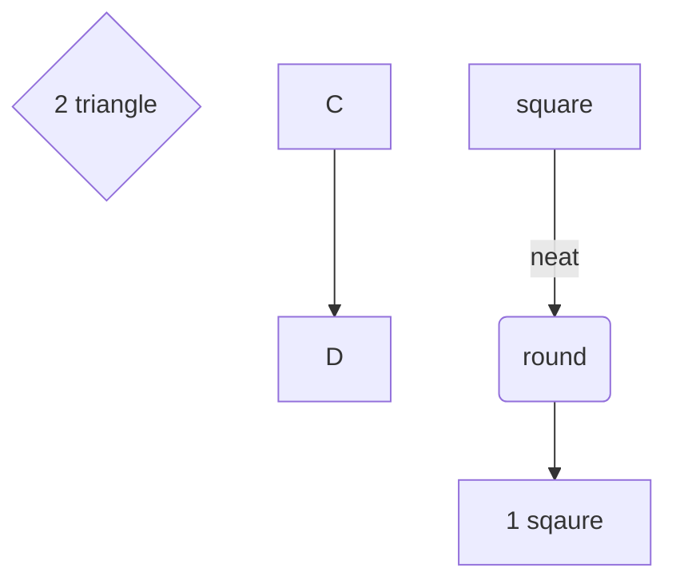

# -
markdown chart

```mermaid
flowchart TD;
  A[1 sqaure];
  B{2 triangle};
  C --> D;
  E[square] -- neat --> F{triangle};
  F(round) --> A;
```

```mermaid
pie;
"Dogs" : 386;
"Cats" : 85;
"Rats" : 15;
```

[gh blog](https://github.blog/2022-02-14-include-diagrams-markdown-files-mermaid/)

[mermaaid info](https://github.com/mermaid-js/mermaid#readme)
